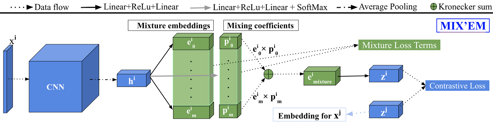

## [MIX'EM: Unsupervised Image Classification using a Mixture of Embeddings](https://arxiv.org/abs/2007.09502) (ACCV 2020)

**Abstract:** We present MIX'EM, a novel solution for unsupervised image classification. MIX'EM generates representations that by themselves are sufficient to drive a general-purpose clustering algorithm to deliver high-quality classification. This is accomplished by building a mixture of embeddings module into a contrastive visual representation learning framework in order to disentangle representations at the category level. It first generates a set of embedding and mixing coefficients from a given visual representation, and then combines them into a single embedding. We introduce three techniques to successfully train MIX'EM and avoid degenerate solutions; (i) diversify mixture components by maximizing entropy, (ii) minimize instance conditioned component entropy to enforce a clustered embedding space, and (iii) use an associative embedding loss to enforce semantic separability. By applying (i) and (ii), semantic categories emerge through the mixture coefficients, making it possible to apply (iii). Subsequently, we run K-means on the representations to acquire semantic classification. We conduct extensive experiments and analyses on STL10, CIFAR10, and CIFAR100-20 datasets, achieving state-of-the-art classification accuracy of 78\%, 82\%, and 44\%, respectively. To achieve robust and high accuracy, it is essential to use the mixture components to initialize K-means. Finally, we report competitive baselines (70\% on STL10) obtained by applying K-means to the "normalized" representations learned using the contrastive loss.

***Source code will be released soon (before the ACCV main conference)***
